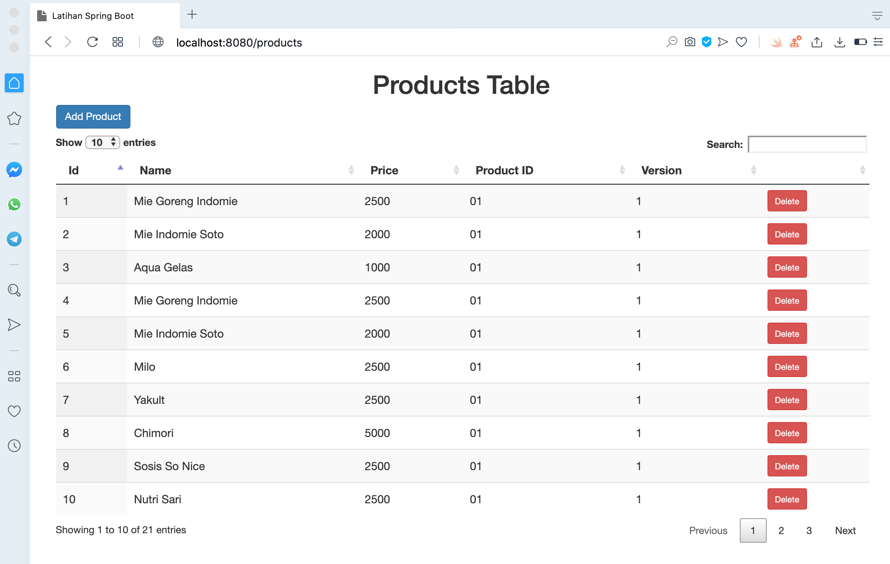
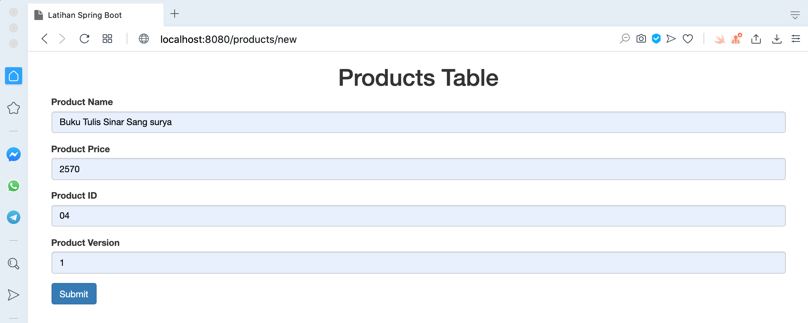
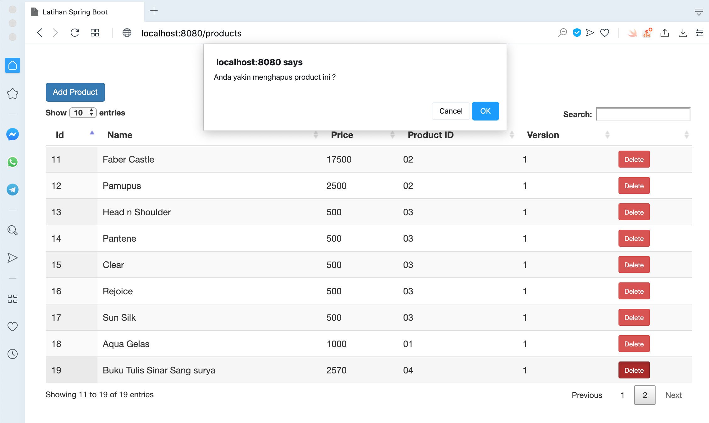
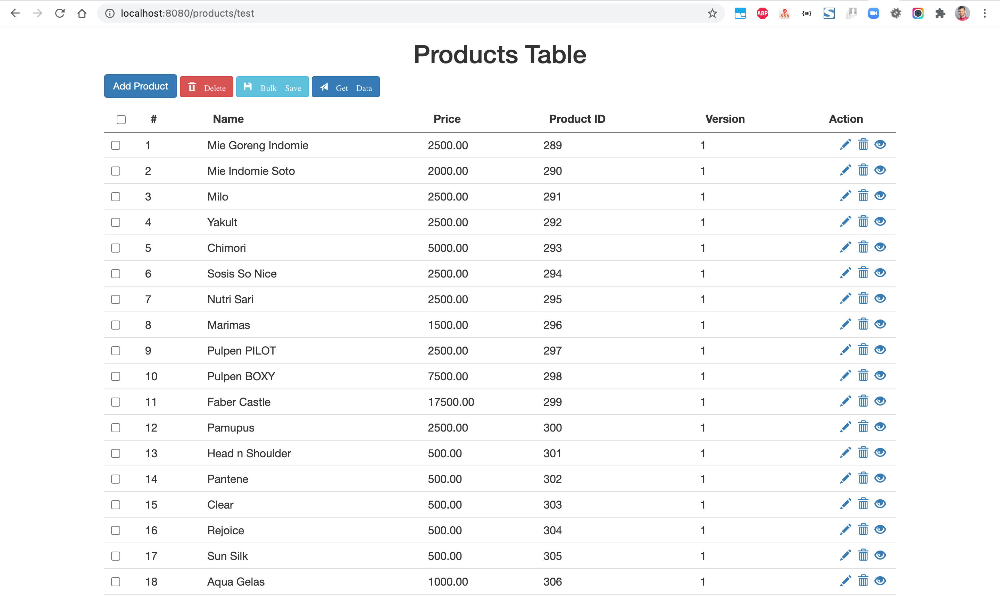

# spring-boot-datatable2
Spring Boot DataTable Sample

## Things to do list:
1. Clone the repository: `git clonehttps://github.com/hendisantika/spring-boot-datatable2.git`.
2. Go to your folder: `cd spring-boot-datatable2`.
3. Run the application: `mvn clean spring-boot:run`.
4. Open your favorite browser: http://localhost:8080/products

## Screen shot

List All Products

Add New Product

Delete Product

List Product with Checkbox

